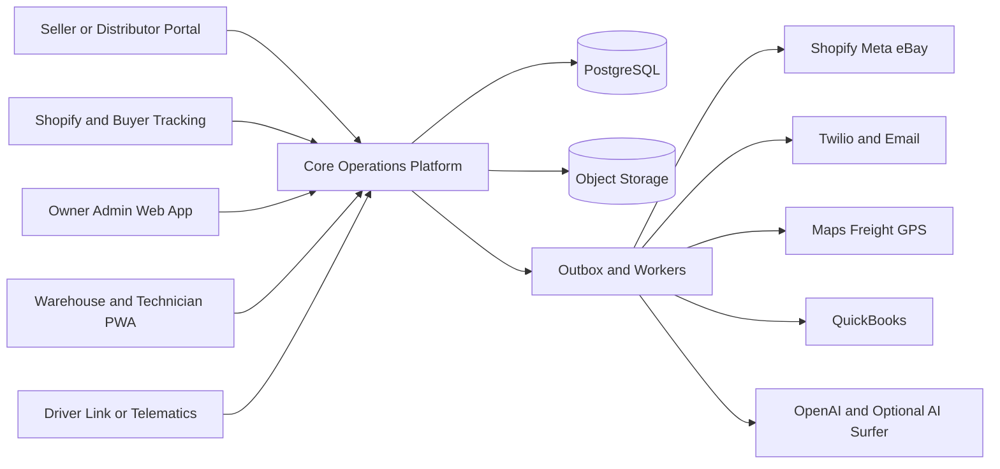
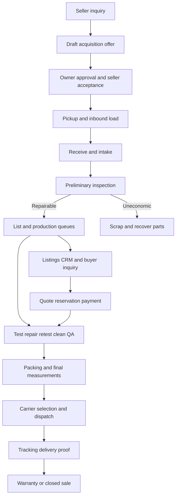

# Simply Clean End to End Product and System Architecture

## Purpose

This is the canonical implementation context for the Simply Clean used-laundry-equipment platform. Product, design, engineering, QA, data, and AI agents should read it before proposing or implementing work.

It combines the September 16, 2026 transcript, the current inventory workbook, the photographed washer and dryer checklists, and decisions made during follow-up discussions. It distinguishes confirmed business requirements, recommended implementation choices, and unresolved questions.

Supporting material:

- [Domain language](./CONTEXT.md)
- [Architecture decisions](./docs/adr/)
- [Source transcript](<./09_16_2026 Transcript .docx>)
- [Current inventory workbook](<./Inventory List.xlsx>)
- [Washer checklist](./20260916_190655.jpg)
- [Dryer checklist](./20260916_190709.jpg)

## Rules for Agents

1. Treat **Decision** sections as accepted unless the user changes them.
2. Treat **Transcript requirement** sections as William's stated requirements.
3. Treat **Recommendation** sections as the current proposed implementation.
4. Treat **Open question** sections as unresolved. Do not invent answers in code.
5. Verify current official documentation before implementing external integrations.
6. Use the canonical terms in [CONTEXT.md](./CONTEXT.md).
7. Prefer deep modules with small interfaces. External tools use adapters at explicit seams and never write arbitrary database records.

## Product Outcome and Priorities

Build one Core Operations Platform that traces every physical machine from acquisition inquiry through intake, production, listing, sale, shipment, delivery, warranty, or parts disposition. The business should operate without William personally coordinating every quote, message, task, parts order, listing, shipment, and accounting handoff.

William's priorities are:

1. Intake and reliable machine identity
2. Test, repair, retest, clean, and QA
3. Sales, listings, CRM, and communications
4. Fulfillment and shipping
5. Accounting, reporting, warranty, and exception handling
6. High-volume sourcing automation after internal capacity is reliable

Acquisition is part of the target product, but it must not accelerate incoming volume before intake and production can process it.

## Product Shape

### Decision

Build one product with role-specific interfaces, not disconnected applications and not a new operating system.



Interfaces may have different URLs and navigation, but share the same backend, database, identity model, audit log, and deployment pipeline.

## Scope

### In scope

- Seller/distributor acquisition inquiries and owner-approved offers
- Inbound pickup planning and seller packing instructions
- Acquisition Loads, arrival, intake, and cost allocation
- Serialized equipment and parts inventory
- Test, repair, retest, clean, and QA
- Parts requests, weekly ordering, receipt ingestion, and cost allocation
- Scrap-for-parts decisions and recovered-parts inventory
- Facebook Marketplace preparation, Shopify, and selected eBay listings
- CRM for sellers, distributors, prospects, buyers, vendors, and shipment contacts
- Business calls, SMS, email, supported social conversations, AI assistance, and follow-up queues
- Quotes, reservations, payments, orders, and availability control
- Pallet planning, dispatch, tracking, arrival alerts, and proof of delivery
- Buyer wishlists, consent, and inventory alerts
- Ninety-day used-equipment warranty claims
- QuickBooks synchronization, dashboards, settings, audit, and exceptions

### Not initially in scope

- Microservices
- An autonomous live voice sales agent
- Unattended automation of a personal Facebook Marketplace account
- QuickBooks as the operational inventory database
- Automatically binding acquisition offers
- Loading optimization that overrides human safety review
- William's separate new-equipment business with its eight-product catalog

## Roles and Interfaces

| Role | Interface | Responsibilities |
| --- | --- | --- |
| Owner Admin | Desktop/tablet web app | Sales, acquisition approval, pricing, exceptions, configuration, refunds, reporting, integrations |
| Warehouse Worker | Shared-tablet PWA | Receiving, scanning, location, packing, loading, photos, measurements, dispatch |
| Technician | Shared-tablet PWA | Testing, defects, repairs, retesting, parts requests, evidence, time |
| Cleaner | Shared-tablet PWA | Cleaning checklist, evidence, readiness handoff; may share Warehouse role initially |
| Seller/Distributor | Seller Portal | Submit equipment, view offer/conditions, prepare pickup, track pickup |
| Buyer | Shopify plus secure tracking pages | Browse, inquire, buy, provide delivery details, track, submit warranty claim |
| Driver | Secure trip link or telematics | Pickup confirmation, location, scans, status, delivery evidence |

Decisions:

- Sales belongs to Owner Admin initially. Add a separate Sales role only when another employee needs distinct permissions.
- Warehouse exists because receiving, locating, packing, loading, and dispatch differ from mechanical work.
- Prefer a time-limited Driver link or existing telematics before creating a full Driver account.
- Shared tablets are allowed, but actions must be attributable to the signed-in worker.

## System Architecture

### Decision

Use a modular monolith with one PostgreSQL database. Keep modules isolated in code. Use a transactional outbox and durable workers for external integrations and long-running automation.

Relevant decisions:

- [Core platform system of record](./docs/adr/0001-core-platform-system-of-record.md)
- [Modular monolith and evented integrations](./docs/adr/0002-modular-monolith-and-evented-integrations.md)
- [Separate operational state axes](./docs/adr/0003-separate-operational-state-axes.md)
- [Supervised Facebook Marketplace automation](./docs/adr/0004-supervised-facebook-marketplace-automation.md)
- [AI Surfer as constrained automation client](./docs/adr/0005-ai-surfer-is-a-constrained-automation-client.md)

### Recommended technical baseline

| Layer | Recommendation |
| --- | --- |
| Web | Next.js, React, TypeScript |
| Tablets | Responsive Progressive Web App; no native app initially |
| Backend | NestJS modular TypeScript application |
| Database | Managed PostgreSQL |
| Files | S3-compatible storage for photos, videos, recordings, receipts, labels, documents |
| Jobs | PostgreSQL-backed durable jobs plus transactional outbox |
| Search | PostgreSQL full-text search initially |
| Hosting | Managed frontend hosting plus managed containers for backend/workers |
| Environments | Development, staging, production |
| Operations | Structured logs, metrics, error tracking, job and integration health |

Hosting provider, ORM, authentication provider, and job library remain implementation choices. They must preserve this modular architecture.

## System of Record

| Information | Authority |
| --- | --- |
| Machine identity, state, location, cost, evidence, availability | Core Operations Platform |
| CRM, quotes, reservations, work, shipments, warranty | Core Operations Platform |
| Store checkout and Shopify payment events | Shopify, projected into platform |
| General ledger | QuickBooks |
| Carrier tracking facts | Carrier/telematics, projected into platform |
| Original communication events | Communication provider, normalized into platform |
| Media and documents | Object storage with platform metadata |

External identifiers are stored on platform records. External systems never mutate unrelated operational tables.

## Core Modules

| Module | Owns |
| --- | --- |
| Identity and Access | Users, roles, permissions, sessions, MFA, external links, audit actors |
| Party and CRM | People, organizations, roles, leads, opportunities, needs, next actions, consent |
| Catalog and Pricing | Models, specifications, sources, retail anchors, modifiers, packing/vehicle rules |
| Acquisition | Inquiries, draft valuations, offers, seller terms, pickup preparation |
| Inventory and Intake | Loads, Machines, QR identity, location, condition, cost ledger, state |
| Production | Work orders, checklists, tests, defects, repairs, cleaning, QA |
| Parts | Stock, recovered parts, requests, ordering batches, receipts, consumption, sales |
| Listings | Listings, groups, packages, photos, approvals, channel publications |
| Communications and AI | Conversations, classification, summaries, drafts, tasks, dropped-ball queue |
| Sales | Quotes, reservations, orders, payments, refunds, fulfillment readiness |
| Logistics | Packing tasks, pallets, load plans, rates, shipments, tracking, proof |
| Wishlist and Marketing | Customer needs, matching, channel consent, alerts |
| Warranty | Terms, claims, evidence, decisions, costs, resolution |
| Accounting | Accounting projections, external IDs, reconciliation, sync errors |
| Reporting | Operational, sales, production, margin, aging, warranty, integration views |
| Administration | Versioned rules, templates, integrations, approval policies |
| Exceptions | Cross-workflow problems, evidence, ownership, exposure, resolution |

## End to End Workflow



## Detailed Workflows

### 1 Seller Portal and acquisition inquiry

The Seller Portal is a separate interface within the same product.

Collect seller/distributor contact, pickup address, ZIP, dock/forklift/stairs/access, timing, equipment quantity/type, manufacturer, model, serial, capacity, payment system, fuel, voltage, phase, nameplate and condition photos, operating condition, missing parts, requested amount, and notes.

A nameplate can usually provide manufacturer, model, serial, voltage, and phase. It cannot prove condition, completeness, dimensions, or operation. Use catalog specifications plus actual overrides.

The seller sees submission status, missing-information requests, approved offer and terms, packing responsibilities, pickup schedule/truck status, and pickup/payment status.

### 2 Acquisition pricing

The engine produces a recommendation, not a binding offer.

```text
Expected retail per proposed machine
  x owner-configured acquisition percentage
  x machine modifiers
  - estimated inbound freight
  - packing/loading allowance
  - repair and uncertainty reserve
  = recommended acquisition ceiling
```

Transcript requirements:

- Target acquisition is generally about 25% to 30% of expected retail.
- Inbound freight reduces the available purchase price.
- Approximately $1,000 expected load profit is a validation warning, not a guarantee.
- Owner approval is initially required.

Expected-retail sources, in priority order: Simply Clean completed sales; owner-approved market comparables; Simply Clean listing history; manufacturer/model references; manual owner anchor. Store source, date, comparable attributes, and confidence. Check terms before scraping sites.

Modifiers include manufacturer/model demand, capacity, year, single/three phase, card/coin, fuel, cosmetic/mechanical condition, completeness, package desirability, access/location, and historical days-to-sale/margin. Three-phase equipment receives a severe negative modifier and must be verified from the nameplate when ambiguous.

### 3 Seller packing and inbound pickup

The seller/distributor normally prepares and loads the equipment. Support instructions, diagrams, protective supplies, negotiated $1,000/$2,000 example loading allowances, optional 10% to 15% conditional holdback, appointment/route/truck planning, pre-pickup photos, seller attestation, and pickup tracking. Amounts are configurable terms, not hardcoded fees.

### 4 Receiving and intake

1. Open the expected Acquisition Load.
2. Photograph each nameplate and arrival condition while unloading.
3. OCR suggests manufacturer, model, serial, voltage, and phase.
4. A worker confirms/corrects suggestions.
5. Create an immutable Machine ID.
6. Print and attach a QR label.
7. Assign location and initial state.
8. Create exceptions for missing, extra, duplicate, or damaged equipment.
9. Enrich data later when necessary so the truck is not delayed.

Use QR codes. The code contains only an opaque/signed ID or deep link; the database is authoritative.

### 5 Load cost allocation

Record seller payment, inbound freight, packing/loading allowance, supplies, other direct costs, and receipts/bills.

- Allocate purchase price by each Machine's share of expected retail.
- Start freight with a transparent per-piece method if data is weak, then use footprint/weight.
- Assign machine-specific parts/labor directly.
- Keep source amount, allocation basis, calculation version, estimates, and actuals.

Example: a $10,000 purchase with $50,000 expected retail allocates $1,000 to a Machine representing $5,000 of expected retail.

### 6 Preliminary inspection and disposition

Perform a short early check. Bearing failure is a key economic decision. Outcomes: Preliminary Passed, Needs Full Test, Owner Review, Scrap for Parts, or Return/Dispute. A Preliminary Passed Machine may be listed before full refurbishment but cannot ship before QA Release.

### 7 Production

```text
Awaiting Test → Test → Passed or Defect → Repair → Retest → Clean → QA Review → QA Released
```

- Reserved/sold Machines receive higher priority.
- Scan QR before work.
- Every step records worker, timestamp, result, notes, and required evidence.
- Failures create Defects without overwriting original results.
- Repairs link parts, labor, outside work, receipts, and retest.
- QA Release is separate from test and clean completion.
- An early clean may create representative photos but is not QA Release.

### 8 Parts workflow

```text
Technician identifies need
→ Check compatible stock
→ Reserve stock or create Parts Request
→ Owner reviews weekly order queue
→ Order from approved source
→ Upload/OCR receipt
→ Owner confirms
→ Receive stock and allocate consumed cost to Machine
```

For parts-only Machines: mark Scrapped for Parts, record recovered parts/condition/location, track recovered value, keep a configured minimum (William suggested five for some parts), and make surplus eligible for Shopify/eBay.

### 9 Listing and publication

After preliminary approval, prepare verified facts, price/package rules, exact or disclosed representative photos, condition, quantity, channel copy, and owner approval.

- Shopify is the long-term showroom, checkout, and SEO surface.
- Facebook Marketplace remains an important lead source.
- Facebook Shop/Instagram use supported catalog connections.
- eBay is selective, especially for parts.

Facebook Marketplace is supervised. Prepare everything automatically, but require a person to publish/reply on unsupported personal Marketplace surfaces. Do not run an unattended personal-account VPS bot.

### 10 CRM and communications

The CRM includes sellers, distributors, prospects, buyers, carriers, parts vendors, and service contacts, not only buyers.

Use a dedicated business mailbox and local 602 business number. SMS/calls arrive through signed provider webhooks. Calls may be recorded/transcribed only under an approved consent policy. Email uses provider push/watch where available plus periodic reconciliation. Supported Page/Professional social messages may sync; personal Marketplace threads remain manual.

The communication assistant normalizes each event; matches Party and business record; classifies buyer/acquisition/shipping/warranty/vendor/spam intent; extracts equipment, quantity, location, budget, timing, promises, and actions; drafts a summary/reply/task; and sends ambiguous matches to human review.

The daily dropped-ball queue includes unanswered messages, unfulfilled promises, stale quotes, pending deposits, missing next actions, and failed sends.

### 11 AI assistant

Decision as of September 17, 2026:

- Primary reasoning: `gpt-5.6-terra`
- Recorded-call transcription: `gpt-transcribe`
- Future low-cost classification/routine replies after evaluation: `gpt-5.6-luna`
- Model selection stays configurable behind an adapter.

| Capability | Responsibility |
| --- | --- |
| AI Reply | Draft SMS/email from verified CRM, inventory, quote, and shipment facts |
| Communication Assistant | Classify, summarize, link, extract actions, create dropped-ball work |

SMS/email require approval initially, then policy-approved FAQ automation may follow. Calls are transcribed/summarized with follow-up drafts; no autonomous live voice agent initially. AI never invents inventory, price, dimensions, freight, warranty, or payment facts. AI Surfer is an optional constrained client, not the CRM or database.

### 12 Buyer quote, reservation, and payment

The listed price is not always final because quantity, discounts, freight, tax, accessorials, or services vary.

```text
Inquiry → qualify quantity/destination/timing/access → quote/freight → approval
→ acceptance → deposit/full payment → reservation → exact Machine assignment
→ Sales Order and fulfillment work
```

Use Available, Temporarily Held with expiration, Reserved, and Sold Awaiting Fulfillment states. Reservations are atomic.

### 13 Shopify integration

Shopify is the ecommerce storefront; the platform owns serialized inventory and operational state.

Use a custom Shopify app:

```text
Platform -- GraphQL Admin API --> products prices media inventory fulfillment
Shopify -- signed webhooks --> customers consent orders payments cancellations refunds
```

Store Shopify identifiers on mapped records. Create/update approved Listings, project price/quantity, create/update Sales Orders from checkout, reserve inventory, process cancellations/refunds, send fulfillment/tracking, withdraw sold items, and reconcile nightly. Use webhook IDs and idempotency.

### 14 Wishlist and opt-in

Opt-in surfaces: custom Shopify popup/inline theme extension, customer portal, SMS YES/keyword, email double opt-in, or recorded verbal consent entered by staff. Store channel, state, timestamp, source, form/version, and withdrawal. Marketing consent is separate from transactional messages.

```text
Customer Need → new inventory match → approved alert → SMS/email → reply updates Opportunity
```

SMS supports STOP; email includes unsubscribe. A purchase alone does not grant marketing consent.

### 15 Packing

Payment/reservation creates a Warehouse Packing Task:

```text
Sold Awaiting Fulfillment → claim task → scan exact Machines → verify QA/condition
→ follow pallet/protection plan → record final dimensions/weight/photos
→ resolve exceptions → Ready for Dispatch
```

Warehouse owns packing by default; Technicians join only for technical work.

### 16 Pallets and delivery method

Create a virtual plan before final quote and validate it after physical packing. Catalog rules store units per pallet, packaged dimensions/weight, orientation/stacking, protection, and liftgate/dock/forklift requirements.

Transcript examples requiring William's verification:

- Two 20-pound-capacity machines may fit on one approximately 50 by 36 inch pallet.
- One 40-pound-capacity machine per pallet.
- A 26-foot truck has an approximately 10,000-pound limit and may carry 12 to 14 typical used machines.
- A 53-foot truck generally needs a dock or forklift.
- Around eight Machines may require comparing LTL with a 26-foot dedicated truck.

| Method | Use | Constraints |
| --- | --- | --- |
| Parcel | Parts/small items | Package dimensions/weight and carrier rate |
| Customer pickup | Buyer collects | Appointment, loading acknowledgment, proof |
| LTL | Small equipment order | Palletized, heavily protected, terminal handling |
| 26-foot dedicated | Medium direct order | Weight/cube, liftgate, mileage |
| 53-foot partial | Large shared load | Dock/forklift, partial-load rules |
| 53-foot dedicated | Full load | Receiver unloading capability |

LTL uses carrier/broker facts and accessorials. Dedicated rates use route distance times a configured per-mile rate plus accessorials. William cited $2.10/mile during the interview; it is historical/configurable, never hardcoded.

### 17 Dispatch and tracking

```text
Ready for Dispatch → final facts → rate/variance approval → carrier booking
→ BOL/labels → pickup scan → In Transit → tracking/arrival alerts
→ proof of delivery → Delivered
```

Dedicated loads may use a recorded security seal. Arrival alerts let the receiver prepare access, dock, forklift, and labor; thresholds such as 60 and 15 minutes are configurable.

### 18 Warranty

William stated a 90-day used-equipment warranty; exact policy remains open.

```text
Issue reported → link Order/Machine → verify coverage → collect evidence
→ review intake/test/repair/QA → technician diagnosis → owner remedy decision
→ track communication/cost → customer confirmation → close
```

### 19 QuickBooks

Assume QuickBooks Online until Desktop is confirmed. Connect an Intuit Developer app through OAuth 2.0 after sandbox/compliance setup. Store company ID and encrypted refresh credentials. Require accountant-approved mappings.

| Platform | QuickBooks Online |
| --- | --- |
| Buyer | Customer |
| Seller/carrier/parts supplier | Vendor |
| Unpaid order | Invoice |
| Immediate paid sale | Sales Receipt |
| Customer payment | Payment |
| Equipment/freight/packing/parts payable | Bill or Expense |
| Refund/credit | Credit Memo or Refund Receipt |
| Receipt/document | Attachment |

Keep serial-level detail in the platform. Use summarized accountant-approved QuickBooks items/accounts. Implement token refresh, outbound queue, idempotency, external IDs, webhooks where useful, retries, dead-letter/manual resync, nightly reconciliation, and sync-error dashboard. Desktop requires a Web Connector adapter.

### 20 Dashboards

Owner Admin sees acquisition approvals, load arrivals, intake backlog, production queues/blockers, technician throughput, parts orders, listing coverage, leads/stale communications, inventory/reservations, packing/dispatch, estimated/actual profit, freight variance, warranty cost, exception exposure, and integration health. Every metric drills into source records.

### 21 Administration

Manage users/permissions, catalog evidence, pricing/modifiers, scrap rules, parts thresholds, packing/vehicle rules, carrier rates, checklist versions, warranty policy, notification templates, AI prompt/approval policy, and integration connections. Version and audit material rules; new rules do not rewrite history.

### 22 Exceptions

One Exception Case model handles inbound damage, missing/incorrect Machines, duplicate serials, phase mismatch, failed tests, uneconomic repairs, stalled parts, reservation conflicts, packing/transit damage, lost/failed delivery, returns/refunds/disputes, warranty, and integration failures.

```text
Problem → linked Exception Case → severity/exposure/evidence/owner
→ approved correction/claim/refund/holdback → costs and communication
→ resolution → close
```

Critical cases alert Owner Admin; routine cases enter the responsible team's queue.

## State Model

Never use one overloaded `status` field.

| Axis | States |
| --- | --- |
| Acquisition Inquiry | Draft, Submitted, Needs Information, Valuing, Awaiting Approval, Offer Sent, Accepted, Rejected, Expired, Pickup Planning, Converted, Closed |
| Acquisition Load | Planned, Awaiting Seller Preparation, Pickup Scheduled, Loading, In Transit, Arrived, Receiving, Reconciled, Closed, Disputed |
| Inventory | Expected, On Hand, Held, Reserved, Allocated, Shipped, Delivered, Scrapped, Returned |
| Production | Not Assessed, Preliminary Passed, Awaiting Test, Testing, Failed Test, Awaiting Repair, Repairing, Awaiting Retest, Awaiting Clean, Cleaning, Awaiting QA, QA Released, Blocked |
| Listing | Not Eligible, Draft, Awaiting Approval, Approved, Live, Paused, Sold Out, Withdrawn |
| Sales | New Lead, Contacted, Qualified, Quote Draft, Quote Sent, Negotiating, Deposit Pending, Reserved, Won, Lost |
| Fulfillment | Not Ready, Awaiting Production, Packing Required, Packing, Exception, Ready for Dispatch, Booked, Dispatched, Delivered, Closed |
| Payment | Not Required, Pending, Partially Paid, Paid, Partially Refunded, Refunded, Disputed |
| Warranty | Open, Evidence Required, Under Review, Approved, Denied, Awaiting Part, Repair Scheduled, Replacement Scheduled, Customer Confirmation, Resolved, Closed |

## Data Model

Principal records:

- Party, Contact Point, Consent, Customer Need, Lead, Opportunity
- Conversation and Message
- Acquisition Inquiry, Acquisition Offer, Acquisition Load
- Model Specification, Machine, Machine Media
- Cost Entry and Allocation
- Checklist Template/Run, Defect, Repair
- Part, Stock Ledger, Parts Request, Purchase Batch
- Sales Listing, Listing Group, Photo Set, Publication
- Quote, Reservation, Sales Order, Payment
- Packing Task, Pallet, Load Plan, Shipment
- Warranty Claim, Exception Case
- Integration Connection, Sync Attempt, Audit Entry

Critical invariants:

- Machine ID is immutable.
- Store serials as strings, never floating-point identifiers.
- Serial duplicates require review; do not silently merge.
- A Machine cannot be reserved twice.
- Published quantity cannot exceed unreserved eligible inventory.
- A Machine cannot ship without exact Order assignment and QA Release unless Owner Admin records an exception.
- Every consumed Part creates a stock movement and Machine cost.
- Every allocation stores source, basis, version, and results.
- Marketing requires channel consent; transactional messages do not imply marketing consent.
- External handlers are idempotent.
- Consequential actions are attributable and audited.

## Important Module Interfaces and Events

Example commands:

- `submitAcquisitionInquiry`, `calculateDraftAcquisitionOffer`, `approveAcquisitionOffer`
- `createAcquisitionLoad`, `recordLoadArrival`, `registerMachine`, `confirmNameplateData`, `allocateLoadCosts`
- `recordPreliminaryInspection`, `createProductionWorkOrder`, `completeChecklistStep`, `recordDefect`, `requestPart`, `receivePartsOrder`, `releaseMachineFromQA`
- `approveListing`, `publishListing`, `captureCommunicationEvent`, `classifyConversation`
- `issueQuote`, `reserveInventory`, `recordPayment`, `createPackingTask`
- `approveLoadPlan`, `bookShipment`, `recordLocationPing`, `confirmDelivery`
- `openWarrantyClaim`, `openExceptionCase`, `projectAccountingTransaction`

Example events:

- `AcquisitionInquirySubmitted`, `AcquisitionOfferApproved`, `SellerAcceptedOffer`
- `AcquisitionLoadDeparted`, `AcquisitionLoadArrived`, `MachineIntakeCompleted`
- `PreliminaryInspectionPassed`, `MachineMarkedForParts`, `PartRequested`, `PartsOrderReceived`
- `MachineQAReleased`, `ListingApproved`, `PublicationChanged`, `LeadCaptured`
- `CustomerNeedMatched`, `QuoteAccepted`, `PaymentReceived`, `InventoryReserved`
- `PackingTaskCreated`, `ShipmentBooked`, `ShipmentApproaching`, `ShipmentDelivered`
- `WarrantyClaimOpened`, `ExceptionCaseOpened`, `AccountingSyncFailed`

These are behavioral interfaces, not permission to expose a public endpoint for every method.

## Integration Decisions

| Integration | Decision |
| --- | --- |
| Shopify | Custom app, GraphQL Admin API, signed webhooks, theme extension for custom opt-in UI |
| Facebook/Instagram | Supported catalog and professional-account messaging interfaces |
| Facebook Marketplace | Automatic preparation; supervised personal-account publication/replies |
| eBay | Select parts/equipment after fee/margin rules |
| Twilio | Recommended local 602 number, SMS/call/status webhooks; recording needs policy |
| Email | OAuth to actual Gmail or Microsoft provider |
| Google Maps | Address validation, route, distance, ETA; ZIP-only is an estimate |
| Freight | Provider adapter with broker portal/manual fallback |
| GPS | Active-shipment sharing first; existing fleet provider if available |
| QuickBooks | Online OAuth/Accounting API unless Desktop confirmed |
| OpenAI | Configurable adapter using the selected models |
| AI Surfer | Optional constrained, revocable automation client |

## Security and Reliability

- Least-privilege roles and MFA for elevated users
- Encryption in transit/at rest and managed secrets
- OAuth instead of shared passwords where supported
- Webhook signature/replay protection and idempotency
- Transactional outbox, retries, dead-letter visibility, manual replay
- Audit for offers, prices, reservations, refunds, payments, QA, shipment release, AI sends
- File validation/malware scanning and signed private-file access
- Retention rules for recordings, location, and PII
- Daily backups with restore tests
- Provider sandboxes, staging, feature flags, monitoring, and alerts

## Current Inventory Migration

Read-only analysis of `Inventory List.xlsx` found:

- 227 non-empty equipment records
- 172 `In Inventory`; 55 `Purchased (Shipped)`
- 100 explicitly passed tests; 19 failed; 10 not tested; many blank test states
- Manufacturer variants such as `Speed Queen` and `Speedqueen`
- 156 serials stored numerically and 71 as text
- Several duplicate serial candidates
- Dexter-specific year/month formulas
- Blank columns and an invalid pivot-cache relationship warning

Migration:

1. Import to staging without changing the source.
2. Convert serials to strings and retain original cell representation.
3. Normalize manufacturers through explicit mappings.
4. Review duplicates; never silently merge.
5. Split overloaded status into separate state axes.
6. Treat blanks as unknown, not complete.
7. Preserve source row, values, file, and timestamp.
8. Validate a physical sample before cutover.
9. Freeze spreadsheet writes after cutover or use a controlled transition.

## Seed Checklist Requirements

The photographed forms are seed requirements, not final safety procedures.

### Washer cleaning

- Remove non-OEM stickers/glue; clean soap tray; replace damaged OEM stickers
- Wipe front/sides; clean drain line; replace missing screws

### Washer testing

- Inspect bearing/noise/drum movement
- Connect drain, water, and correct power; check leaks and control display
- Confirm 120 V, 220 V single-phase, or 220 V three-phase requirement
- Close/lock door
- Video placard, payment, cycle buttons, cold/hot flow, and high spin when possible
- Unplug and drain safely

### Dryer cleaning/inspection

- Remove drum nails/screws; escalate drum holes
- Remove non-Dexter stickers/glue
- Vacuum top, back, exhaust, lint drawers/screens; clean computer board
- Repair stickers/screens; wipe front/sides; replace screws
- Inspect belts and heat-damaged wiring

### Dryer testing

- Inspect bearings; safely access computer board; confirm both-pocket fuses
- Connect hot/neutral/ground; verify display
- Video placard, payment/success indicator, temperatures for both pockets
- Capture ignitor/spark and door-switch behavior for both pockets
- Demonstrate programming mode

William must approve exact safety steps, measurements, evidence, and pass/fail criteria.

## Reporting Definitions

- **Inventory aging:** days since Intake for On Hand inventory not Delivered/Scrapped.
- **Intake-to-list:** Load arrival to first Live Publication.
- **Intake-to-sale:** Load arrival to accepted Sales Order.
- **Production cycle:** first Test to QA Release.
- **First-pass yield:** initial Test passes divided by Machines initially tested.
- **Gross profit:** revenue less accountant-approved allocated purchase, inbound freight, packing, repairs, labor basis, subsidy, refunds, warranty.
- **Freight variance:** actual minus quoted freight.
- **Response time:** inbound business message to first meaningful response.
- **Dropped ball:** open commitment/request without a valid next action before threshold.

## Delivery Plan

### Release 0 Foundation and migration

Identity, roles, audit, storage, jobs, schema/state machines, catalog foundation, workbook staging/cleanup, Machine Registry, QR labels.

### Release 1 Intake and production

Load receiving, rapid tablet intake, nameplate/OCR confirmation, location, preliminary inspection, washer/dryer checklists, evidence, defects, repairs, retests, cleaning, QA, parts requests, production dashboard.

### Release 2 Sales control

Listings/groups/photos/pricing, CRM/Conversations/AI/needs, quotes/reservations/payments/orders, Shopify, quantity control, Facebook preparation/supervision.

### Release 3 Fulfillment and after-sales

Packing/pallets/final facts, carrier comparison/booking/BOL/tracking/alerts, delivery proof, warranty, returns/refunds/exceptions, parts sales/eBay.

### Release 4 Accounting and optimization

QuickBooks/reconciliation, profitability dashboards, buyer matching/alerts, improved pricing/load planning/telematics.

### Release 5 Acquisition automation

Seller Portal, catalog recognition, draft acquisition pricing, seller packing/holdback, pickup planning/tracking.

This order stabilizes intake, production, and sales before increasing acquisition volume.

## Acceptance Criteria

- Every Machine is traceable from inquiry/load through delivery or disposition.
- Every Machine is searchable by internal ID, QR, serial, model, Load, location, Order, or Shipment.
- No Machine/part quantity can be reserved twice.
- Separate state axes replace spreadsheet ambiguity.
- A sale creates/prioritizes production and packing work.
- QA evidence belongs to the exact Machine shipped.
- Live Publications reflect availability or expose a sync exception.
- Every business Conversation has a next action or closed outcome.
- Marketing sends have consent evidence.
- Estimates and actual costs remain distinct and auditable.
- Shipments have final units, dimensions, weight, method, status, and proof.
- Warranty can inspect full Machine history.
- QuickBooks/external failures are visible, retryable, and non-corrupting.
- AI actions are attributable, reviewable, and reversible where practical.

## Open Questions Requiring Owner Confirmation

1. QuickBooks Online or Desktop?
2. Which business email provider and phone number?
3. What call-recording consent policy applies?
4. Which LTL broker/carrier and integration are used?
5. Exact pallet and truck rules by model/capacity?
6. Final accessorials and per-mile pricing?
7. Exact 90-day warranty conditions, exclusions, remedies, and start date?
8. Initial acquisition modifiers and approval thresholds?
9. Standard or case-by-case packing holdback?
10. Which labor costs enter profitability/COGS?
11. Which sales-tax configuration is authoritative?
12. Approval limits for price, refund, warranty, scrap, and shipment?
13. Recording, location, and PII retention periods?
14. Which Meta assets currently exist?
15. Does AI Surfer expose supported interfaces, logs, and revocable credentials?

## Change Control

- Record material reversals in a new ADR.
- Update this file when business rules, lifecycle, ownership, roles, integrations, or delivery order change.
- Update [CONTEXT.md](./CONTEXT.md) for new canonical domain terms.
- Add concrete acceptance tests to feature specifications when implementation begins.

## Reuse Map

This map describes the canonical home for reusable product decisions. The application foundation was established by `SF-01`; later tickets deepen these locations rather than creating parallel foundations.

### Concept -> location

| Concept | Canonical location |
| --- | --- |
| Product intent and delivery order | `PRODUCT.md`, this document, and `ROADMAP.md` |
| Canonical domain terms | `CONTEXT.md` |
| Accepted architectural decisions | `docs/adr/` and `DECISIONS.md` |
| Safe Foundation milestone requirements | `docs/safe-foundation-program.md` |
| Per-ticket implementation contracts | `specs/` |
| Per-ticket architecture reviews | `reviews/` |
| Web and PWA interface | `apps/web` |
| HTTP API and domain modules | `apps/api`; behavior inside `src/modules/<module>` |
| Cross-application request/event contracts | `packages/contracts` |
| Validated runtime configuration | `packages/config` |
| PostgreSQL schema, migrations, and database boundary | `packages/database` |
| Shared integration-test fixtures and builders | `packages/test-support` |
| Inventory/Intake operations | `apps/api/src/modules/inventory`; later imports, files, QR, production, and listings call its exported service interface rather than its tables |
| Machine, Load, and Location contracts | `packages/contracts/src/inventory.ts` |
| Machine identity matching | Inventory-owned normalization and unique manufacturer/serial claims; never controller, UI, or import-local matching |
| Inventory/import behavior | Inventory API module; spreadsheet parsing remains behind the future Import module/interface |
| QR behavior | Owning Inventory/Intake API module, not UI components |
| File metadata and access policy | `apps/api/src/modules/files`; its exported service owns attachment policy and its `StorageAdapter` owns private bytes through local or S3-compatible implementations |
| File contracts and permissions | `packages/contracts/src/files.ts` and the canonical policy in `packages/contracts/src/authorization.ts` |
| Authentication and staff identity | `apps/api/src/modules/identity`; Better Auth owns credentials/sessions and the platform profile owns role/active state |
| Authorization policy | `packages/contracts/src/authorization.ts` for role/permission decisions; enforced by the Identity module's global API guard |
| Authenticated web API access | Same-origin `/api/*` proxy in `apps/web/next.config.ts`; validated clients in `apps/web/src/lib` |
| Audit, idempotency, outbox, and durable jobs | `apps/api/src/modules/operations`; domains call its mutation-recorder/idempotency ports with their active database executor, and its worker dispatches the PostgreSQL outbox |
| Operations contracts and Owner review | `packages/contracts/src/operations.ts`, `/operations/*`, and `apps/web/src/app/(protected)/admin/operations` |

### Conventions (rules no keyword search will find)

- The API module that owns a business concept owns its mutation rules and persistence boundary. Controllers and UI code do not contain alternate copies of those decisions.
- Modules collaborate through explicit services/ports and domain events, not arbitrary cross-module database writes.
- All untrusted input is validated at the boundary. Authorization is enforced server-side inside or immediately before the owning use case.
- Environment variables are parsed once through `packages/config`; application modules consume validated configuration objects.
- Database drivers are created only through `packages/database`. Migrations are explicit deployment/setup work and never block the API liveness endpoint.
- Owning repositories use the Drizzle handle and transaction callback exposed by `DatabaseConnection`; they never create independent database clients.
- Local and deterministic tests use isolated PGlite; deployed environments use the PostgreSQL wire driver and reject accidental PGlite use by default.
- Cross-application payloads are parsed with the runtime schemas in `packages/contracts`, not trusted through TypeScript types alone.
- Better Auth owns password hashing, credential lookup, secure cookies, and session lifecycle. Application roles, active state, and permission decisions remain in the platform Identity module.
- Protected APIs derive identity from the signed session and current persisted profile on every request. Browser navigation is never an authorization boundary.
- Role changes and deactivation revoke active sessions; the final active Owner Admin cannot be demoted or deactivated.
- Machine ID is immutable and independent of serial number. Serials remain strings; ambiguous duplicates become reviewable conflicts.
- Machines begin with provisional identity and nullable plate facts. Raw identity submissions, verification decisions, and relocations are immutable, attributable history.
- A verified Machine owns a unique normalized manufacturer/serial claim. A provisional or conflicted Machine owns none; duplicate verification persists a linked conflict instead of merging records.
- Operational mutations use expected versions. Current location changes only through the Inventory relocation use case, in the same transaction as location history.
- Inventory, production, listing, sales, payment, and shipment states remain independent axes.
- Domain changes and their outbox records commit atomically. Retried handlers use idempotency keys or provider event IDs.
- Cross-domain audit is a privacy-safe index, not a replacement for detailed domain history. Owning repositories record the domain change, audit entry, and outbox job in one transaction.
- Retry-prone create commands hash their idempotency keys, compare canonical parsed-input fingerprints, and replay target references. Raw keys and request bodies are never persisted.
- Outbox delivery is at least once. Workers claim bounded leases, increment attempts on claim, reject stale completion, back off finitely, and dead-letter exhausted work. Future handlers must deduplicate with the stable job ID.
- Files are private by default. PostgreSQL holds metadata and relationships; object storage holds bytes; access uses short-lived grants.
- File storage keys are generated IDs, never client filenames. Upload/download grants are stored only as hashes, bound to the exact user/session/file/operation, expire quickly, and are consumed once.
- File readiness requires detected byte signature, size, media type, checksum, and stored-object metadata to agree. Upload leases plus optimistic versions prevent cleanup from racing an in-flight write.
- File activity is immutable and privacy-safe. It records actors/actions/request IDs but never bytes, tokens, filenames, cookies, or request bodies.
- Audit records are append-only, privacy-safe, attributable, and created by mutation paths rather than UI logging.
- Migration imports always stage and preview before authoritative commit. Missing facts remain unknown and uncertain matches are not merged automatically.
- QR payloads contain only opaque or signed lookup material. Authorization occurs after resolution.
- Shared packages exist only for cross-application decisions. Domain descriptions stay local to the owning module.
- Open questions in this architecture remain configuration or explicit blockers; they are never embedded as assumed constants.

### Known duplication debt (which copy is canonical)

- The workflow is explained in generated Word and PowerPoint artifacts as well as this document. `ARCHITECTURE.md` and `CONTEXT.md` are canonical; generated artifacts are communication outputs only.
- No application-code duplication exists yet because the product implementation has not been bootstrapped.

### Anti-reuse markers (do NOT reuse these)

- Do not import or adapt `.codex-build/**` into the application. It is private artifact-generation output.
- Do not reuse `build_workflow_doc.py` as application infrastructure. It generates a document and has no operational boundary.
- Do not treat `Inventory List.xlsx` as a schema, database, or live source of truth. It is immutable migration input.
- Do not use files under `Deliverables/` as runtime templates or authoritative business rules.
- Do not build new code on an unattended personal Facebook Marketplace browser session.
